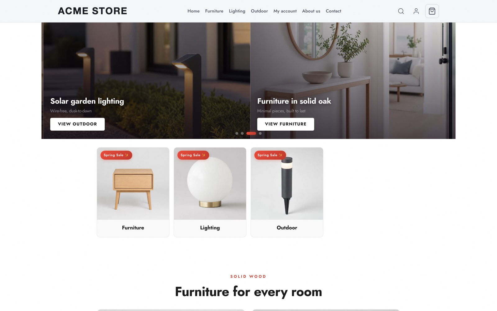
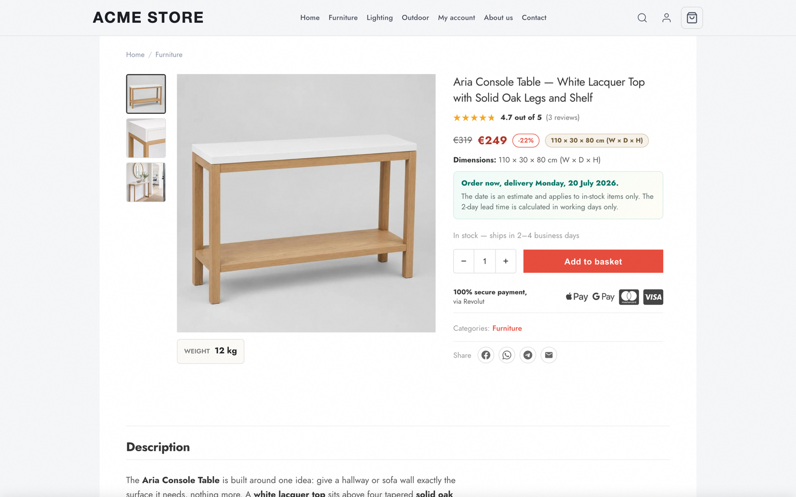
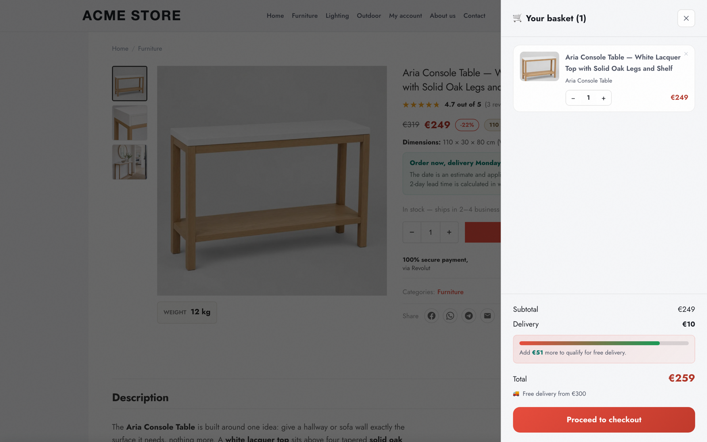

# Open Ecommerce

[](https://github.com/Unic-Online/open-ecommerce/actions/workflows/ci.yml)
[](./LICENSE)

**Live demos:** [storefront-single](https://acme-storefront-single.vercel.app) · [storefront-i18n](https://acme-storefront-i18n.vercel.app) — real checkout (cash on delivery) against an isolated demo database.

Two production-extracted Next.js e-commerce templates for developers who run
their own store — built to remove the doubts that come with running one:

- **Your tracking is right.** Meta Pixel + server-side Conversions API with
  event dedup, consent gating, and a replay cron for failed purchase events;
  GA4 and a Google Merchant feed wired in. No more "is the pixel even
  firing?"
- **Your money math is right.** Order totals are recomputed on the server
  from the catalog — the client can never send a wrong (or forged) price.
  Payment webhooks are signature-verified with replay protection.
- **You can change it without breaking it.** 1,800+ unit tests and ~280
  Playwright e2e specs gate every change in CI, and each template ships an
  `AGENTS.md` operating manual — so an AI agent can rebrand the shop, add
  products, or restyle it from a prompt and *prove* checkout still works.
- **It costs ~nothing to run.** One Next.js app + MongoDB, no commerce
  backend. Free tiers (Vercel, Mongo Atlas, Resend) carry you while you
  validate; a commercial production deploy belongs on Vercel Pro (~$20/mo) —
  or any Node host, nothing here is Vercel-specific except the cron config.
- **No payment lock-in.** Cash on delivery works with zero provider config;
  card payments are confined to a 4-file provider surface with Revolut as
  the reference implementation — [PAYMENTS.md](./PAYMENTS.md) is the recipe
  for bringing Stripe, PayPal, or anything else.

Both templates share the same opinionated design (light luxury /
glassmorphism, CSS-variable theming), an admin dashboard, abandoned-cart
recovery, moderated reviews, transactional email, and a 5-product
"Acme Store" demo catalog with generated imagery.

| | [`storefront-i18n`](./storefront-i18n) | [`storefront-single`](./storefront-single) |
|---|---|---|
| Languages | next-intl, `en` (default) + `ro`, per-locale URLs | English only, no next-intl |
| Markets | 2 (english/EUR + ro/RON), host- and locale-aware | 1 (`main`, EUR) |
| UI copy | `messages/{en,ro}/*.json` | `src/content/strings.ts` (typed) |
| Products | `content/products/<slug>.ts` with per-locale content + per-market prices | same file shape, flattened: single `content` + single EUR price |
| Payment ids | `ramburs` \| `card` | `cod` \| `card` |
| Unit tests | 1001 | 812 |
| e2e | 133 passed / 6 auto-skip (at extraction) | 129 passed / 6 auto-skip (at extraction) |

Pick `storefront-single` unless you concretely need multiple languages or
markets; its AGENTS.md says the same to AI agents.

## Screenshots

`storefront-single` with the demo catalog — `storefront-i18n` shares the same design:



| Product page | Cart drawer |
|---|---|
|  |  |

## Features

**Storefront**

- Light-luxury design on a CSS-variable design system, with three ready themes (`theme.css`, `theme-warm.css`, `theme-mono.css`)
- Product pages with galleries, delivery estimates, weight/dimensions, related products — catalog is one file per product
- Cart drawer with free-delivery progress bar and coupons; browser back button closes the drawer instead of leaving the page
- Customer reviews: curated static corpus + moderated visitor submissions, verified-purchase enforcement (one review per order + product), star summaries, topic filters, photo gallery
- SEO out of the box: JSON-LD structured data, `sitemap.ts`, `robots.ts`, per-page metadata, and a Google Merchant product feed at `/google-merchant.xml`

**Checkout & payments**

- Revolut card + Revolut Pay + Apple/Google Pay wallets, plus cash on delivery
- Order totals recomputed server-side on every request — client prices are never trusted
- Signature-verified Revolut webhooks (key-rotation window) with a webhook inbox; orders persist locally before any provider call
- Passwordless customer accounts (email magic links) with order history

**Retention & marketing**

- Abandoned-cart plugin: exit-intent popup, server cart sync, recovery emails with HMAC-signed links, recovery cron
- Review-request email cron after delivery
- Meta Pixel + server-side Meta CAPI with a failed-event replay cron; GA4; granular cookie-consent banner

**Admin & operations**

- Admin dashboard: order list with filters, fulfillment + shipment emails, CSV export, review moderation queue
- All transactional email through one `sendEmail()` chokepoint (Resend) — idempotent sends, dry-run mode for tests/demos
- Optional Grafana Faro browser RUM and a pluggable server error sink

**Engineering**

- Zod-validated env layer (`src/env.ts`) with a fully annotated `.env.example`; browsing/cart/build work with zero env
- 800–1,000 unit tests and ~130 Playwright e2e specs per template, all in CI
- `pnpm sync-docs` keeps the env documentation true to the code

## Why these templates?

Most open-source storefronts are either demos (pretty, but checkout is a
stub) or platforms (a second system to deploy and operate). These templates
are the third thing: a complete store in one Next.js app, extracted from a
shop that runs in production.

- **No commerce backend to operate.** MongoDB is the only stateful
  dependency — no headless-commerce server, no GraphQL gateway, no admin SaaS.
- **Payments without lock-in.** Cash on delivery works with zero provider
  config; card + wallets ship as a Revolut reference implementation behind
  a small documented surface ([PAYMENTS.md](./PAYMENTS.md)) — bring Stripe,
  PayPal, or any other PSP. Consent banner and legal page skeletons
  included.
- **Real operations, not just a storefront.** Admin dashboard (orders,
  fulfillment, CSV export, review moderation), transactional emails,
  abandoned-cart recovery with signed links, moderated customer reviews,
  Meta CAPI + GA4 + Google Merchant feed.
- **Server-side money math.** Order totals recomputed on the server,
  webhook signatures verified, recovery/account links HMAC-signed.
- **Agent-ready.** Each template ships an `AGENTS.md` manual — architecture
  rules, invariants, and change recipes that make AI coding agents
  productive (and safe) in the codebase.
- **Tested like an app, not a template.** 1,800+ unit tests and ~260
  Playwright e2e specs across the two templates, all run in CI.

## Using a template

Fastest start (copies one template, no git history):

```bash
npx degit Unic-Online/open-ecommerce/storefront-single my-shop
cd my-shop && pnpm install && pnpm dev
```

Or deploy straight to Vercel:

[](https://vercel.com/new/clone?repository-url=https%3A%2F%2Fgithub.com%2FUnic-Online%2Fopen-ecommerce%2Ftree%2Fmain%2Fstorefront-single)

Or copy the folder out of a clone, then:

```bash
pnpm install
cp .env.example .env.local   # fill: MONGODB_URI, Revolut keys, RESEND_API_KEY, ADMIN_PASSWORD, HMAC secrets
pnpm dev
```

Browsing/cart works with zero env. Checkout needs Mongo + Revolut (sandbox
or live); emails need Resend **with your own verified sender domain** (the
placeholder `orders@example.com` will be rejected until you change
`site.config.ts` contact emails to a domain verified in Resend). Full env
table in each template's `.env.example` and `AGENTS.md`; deploy steps
(Vercel, crons, `pnpm revolut:webhook create`) in each `README.md`.

## AI-first quickstart

These templates are built to be worked on by AI coding agents, not just
humans. Each ships an **`AGENTS.md`** — a ~350-line operating manual written
for agents: the file map, the invariants ("this is NOT the Next.js you
know"), and step-by-step recipes for the changes you'll actually make.
`CLAUDE.md` is just `@AGENTS.md`, so Claude Code picks it up automatically;
point Cursor or other tools at `AGENTS.md` explicitly.

The workflow:

```bash
npx degit Unic-Online/open-ecommerce/storefront-single my-shop
cd my-shop && pnpm install
claude   # or your agent of choice
```

Then prompt in plain language — the recipes in AGENTS.md keep the agent on
rails. Example prompts that map 1:1 to its How-to sections:

- *"Rebrand this store to 'Atelier Nord' — follow the Rebrand recipe in
  AGENTS.md (site.config.ts, theme, logo)."*
- *"Add a product 'Fjord Oak Bench' in the furniture category at €349 using
  the Add-a-product recipe, with placeholder copy and images."*
- *"Switch the site to the warm theme."*
- *"Enable the abandoned-cart exit-intent popup and tell me which env flags
  you set."*
- *"Replace the demo imagery: regenerate from
  scripts/demo-images.manifest.json with my product photos as reference."*

Why agents do well here: every brand/market/category decision lives in one
typed file (`src/site.config.ts`), products are one file each, UI copy is
typed, env access is Zod-validated, and the unit + e2e suites catch
regressions — so ask the agent to finish every change with
`pnpm lint && pnpm typecheck && pnpm test`.

## Customization

Customization is concentrated by design:

- `src/site.config.ts` — brand, markets, categories, storage namespacing, feature flags
- `src/styles/theme.css` — entire design system (swap `theme-warm.css` / `theme-mono.css` via the `@import` in `globals.css`)
- `content/products/*.ts` — one file per product (+ images in `public/images/<slug>/`)
- `messages/` (i18n) or `src/content/strings.ts` (single) — UI copy
- `public/logo.svg`, `src/app/icon.svg` — brand assets

Demo product imagery is regenerable: `scripts/demo-images.manifest.json` +
the gpt-image batch script (see manifest header).

## Verification record

Both templates: `pnpm build`, `pnpm typecheck`, `pnpm test`, `pnpm test:e2e`
green at extraction time. Works-from-zero proven by fresh install in a clean
directory, `.env.local` with sandbox Revolut + fresh Mongo DB + Resend key,
prod build + boot, then placing a real cash-on-delivery order
(server-computed totals) and a real Revolut sandbox card order (provider
order id returned), both visible in `/admin/orders` after env-password
login. The inbound webhook→paid transition needs a public URL and is covered
by the signed-payload e2e specs instead.

## License

[MIT](./LICENSE)
